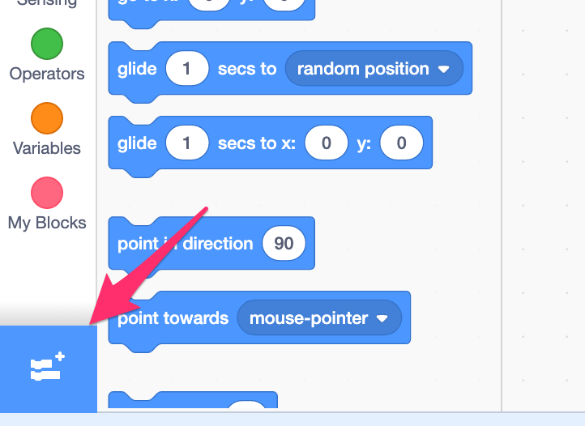
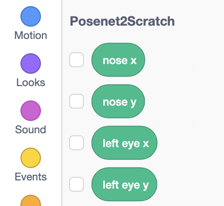
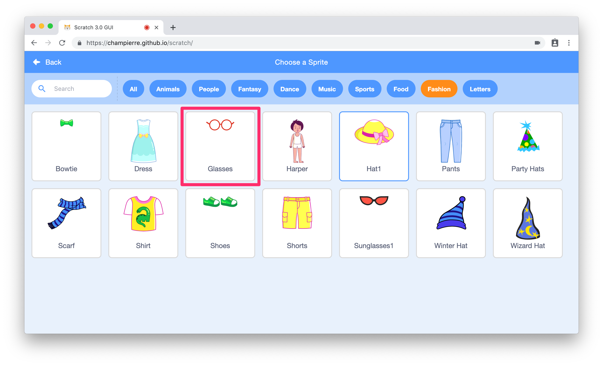
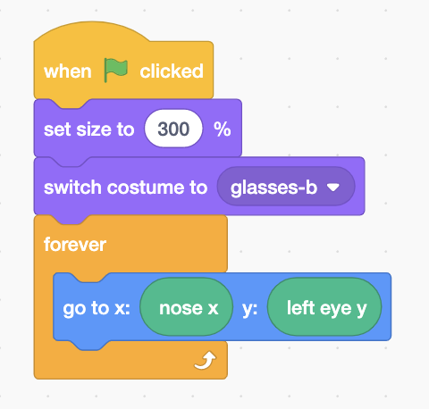
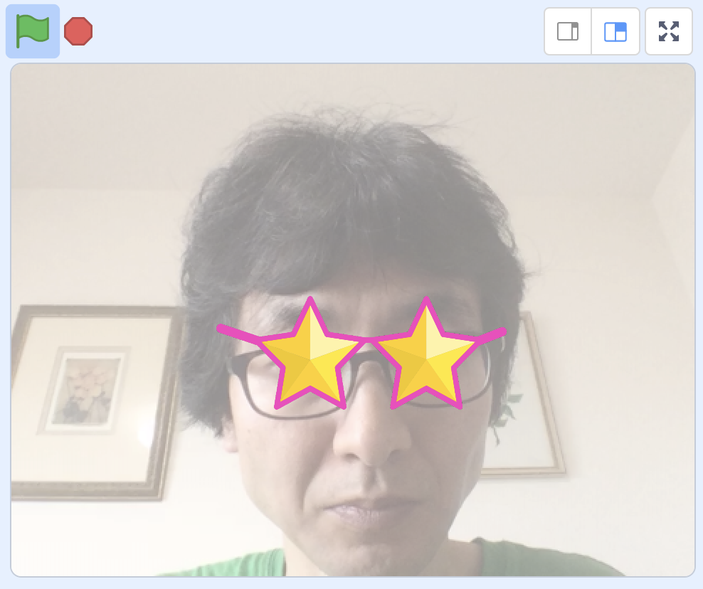

# PoseNet2Scratch

*Read this in other languages: [English](README.en.md), [日本語](README.md)*

PoseNet2Scratch can detect human pose and add special Scratch blocks that can get x and y position of each part of the body.

It uses [PoseNet](https://medium.com/tensorflow/real-time-human-pose-estimation-in-the-browser-with-tensorflow-js-7dd0bc881cd5), a machine learning model , for Real-time Human Pose Estimation. PoseNet advantage is that it can detect human poses quickly and accurately with a normal WebCam without using a special device such as Kinect.

[ml5.js](https://ml5js.org/), a JavaScript library for machine learning, is used to connect it with Scratch 3.


- [Sample Project(nekorider)](https://github.com/champierre/posenet2scratch/raw/master/projects/nekorider.sb3)
- [Sample Project(glasses)](https://github.com/champierre/posenet2scratch/raw/master/projects/glasses.sb3)

Try [the customized Scratch 3](https://stretch3.github.io/) that has PoseNet2Scratch as an extension.

## Examples of use

- [Skutch Brothers(Super Smash Brothers type game)](https://www.youtube.com/watch?v=AutgIeyxlb0)


## Requirements

- OS
  - Windows 8
  - Windows 10
  - MacOS
  - iOS
- Browser
  - Chrome
  - Safari(iOS)

PoseNet2Scratch sometimes does not work because of some Chrome extensions. Plese switch to [Guest Mode](https://support.google.com/chrome/answer/6130773) in such cases.

## How to use

1. Open https://stretch3.github.io/ on a browser([Google Chrome](https://www.google.com/intl/ja_jp/chrome/) is recommended). PoseNet2Scratch sometimes does not work because of some Chrome extensions. Plese switch to Guest Mode in such cases.

2. Click "Add Extension" button(Folder with "+" mark icon).


3. Select "PoseNet2Scratch" extension.


4. You can use PoseNet2Scratch blocks.


5. Select "Video Sensing" extension, if you want to see the image captured by webcam on the stage screen. This is not mandatory.


6. Add "Glasses" sprite.


7. Make a code like below.


8. You will have the glasses shown at the center of your face(x position of the nose) and at the hight of your eyes(y position of the left eye).


With PoseNet2Scratch extension blocks, you can get x and y position of the following body parts:

- nose
- left eye
- right eye
- left ear
- right ear
- left shoulder
- right shoulder
- left elbow
- right elbow
- left wrist
- right wrist
- left hip
- right hip
- left knee
- right knee
- left ankle
- right ankle

## For Developers - How to run PoseNet2Scratch extension on your computer

1. Setup LLK/scratch-gui on your computer.

    ```
    % git clone git@github.com:LLK/scratch-gui.git
    % cd scratch-gui
    % npm install
    ```

2. In scratch-gui folder, clone PoseNet2Scratch. You will have posenet2scratch folder under scratch-gui.

    ```
    % git clone git@github.com:champierre/posenet2scratch.git
    ```

3. Run the install script.

    ```
    % sh posenet2scratch/install.sh
    ```

4. Run Scratch, then go to http://localhost:8601/.

    ```
    % npm start
    ```

## Licence

- PoseNet2Scratch is under [BSD 3-Clause License](./LICENSE.md), open source and freely available to anyone. You can use it at your classes, workshops. Commercial usage is also accepted. If you or your students created something cool using PoseNet2Scratch, please share it on SNS using hashtag **#posenet2scratch** or let me know to any of these contacts.

## Contacts

- Twitter

    