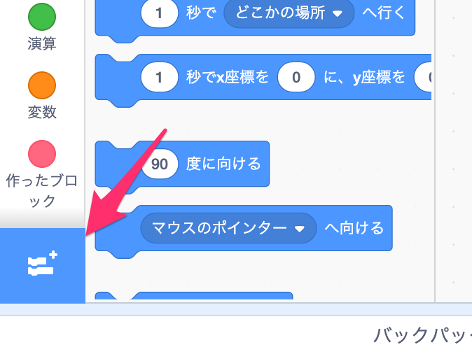
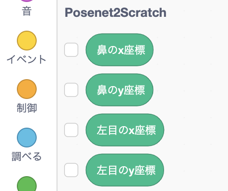
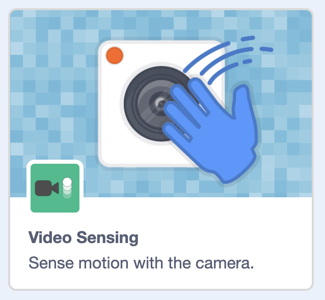
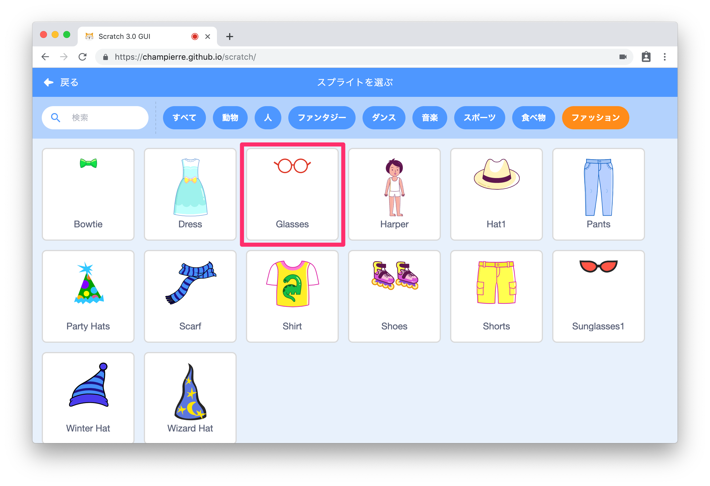
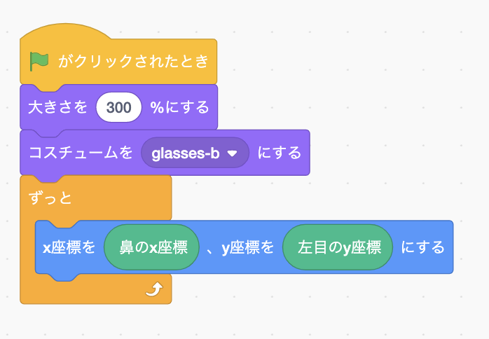

## サポートのお願い

PoseNet2Scratchは2020年よりオープンソースかつ無料で提供しており、学校や各種プログラミング教室はじめさまざまな場所で利用されております。継続して開発を続けるためには、使っていただいている皆さまからの支援が必要です。<br />
[一杯のコーヒー](https://www.buymeacoffee.com/champierre)という形でサポートをいただけると大変ありがたく思います。

<a href="https://www.buymeacoffee.com/champierre" target="_blank"></a>

# PoseNet2Scratch

*Read this in other languages: [English](README.en.md), [日本語](README.md)*

PoseNet2Scratchは人の姿勢を検出し、身体の各部分のxとyの位置を取得できるScratch拡張ブロックを追加することができます。

リアルタイムの姿勢検出をおこなうために[PoseNet](https://medium.com/tensorflow/real-time-human-pose-estimation-in-the-browser-with-tensorflow-js-7dd0bc881cd5)を使っています。Kinectのような特別なデバイスを使うことなく、普通のウェブカメラで素早く高精度で検出できるところが大きな特徴です。

また、Scratch 3の拡張機能として利用できるように、機械学習用JavaScriptライブラリ[ml5.js](https://ml5js.org/)を使用して実装しています。


- [サンプルプロジェクト(ネコライダー)](https://github.com/champierre/posenet2scratch/raw/master/projects/nekorider.sb3)
- [サンプルプロジェクト(サングラス)](https://github.com/champierre/posenet2scratch/raw/master/projects/glasses.sb3)


PoseNet2Scratchは、[独自バージョンのScratch 3](https://stretch3.github.io/)で実際に体験できます。

## Examples of use(活用例)

- [スクッチブラザーズ(スクッチブラザーズは、scratchの拡張機能の、posenet2scratchを使った作品です)](https://www.youtube.com/watch?v=AutgIeyxlb0)

## Requirements(推奨環境)

- OS
  - Windows 8
  - Windows 10
  - MacOS
  - iOS
- ブラウザ
  - Chrome
  - Safari(iOS)

Chrome の拡張機能を使用している場合に、正常に動作しないことがあるので、もしうまく動かないという場合には、[ゲストモード](https://support.google.com/chrome/answer/6130773?hl=ja)に切り替えてお試しください。

## How to use(使い方)

1. ブラウザで https://stretch3.github.io/ を開きます。ブラウザは[Google Chrome](https://www.google.com/intl/ja_jp/chrome/)を使用してください。Chrome の拡張機能を使用している場合に、正常に動作しないことがあるので、もしうまく動かないという場合には、[ゲストモード](https://support.google.com/chrome/answer/6130773)に切り替えてお試しください。

2. 「拡張機能を追加」ボタン（+が付いたフォルダのアイコン）をクリックします。


3. 「PoseNet2Scratch」拡張機能を選択します。


4. PoseNet2Scratchのブロックを使用できます。


5. ウェブカメラでキャプチャした画像をステージ画面に表示するには、「Video Sensing」拡張機能を選択します。これは必須ではありません。


6. 「Glasses」(眼鏡)スプライトを追加します。


7. 以下のようなコードを作ります。


8. 顔の中央（鼻のx位置）と目の高さ（左目のy位置）に眼鏡が表示されます。


PoseNet2Scratch拡張ブロックを使うと、以下の各身体の部分のxおよびy座標を取得できます。

- 鼻
- 左目
- 右目
- 左耳
- 右耳
- 左肩
- 右肩
- 左ひじ
- 右ひじ
- 左手首
- 右手首
- 左腰
- 右腰
- 左ひざ
- 右ひざ
- 左足首
- 右足首

## How to use from Xcratch(Xcratch からの利用)

PoseNet2Scratch は必要な独自拡張機能を読み込むことができる Scratch Mod の「[Xcratch](https://xcratch.github.io/)」からも利用できます。

Xcratch の URL である [https://xcratch.github.io/](https://xcratch.github.io/) をブラウザで開き、「エディターを開く」を選んだあと、「拡張機能を選ぶ」画面から「拡張機能を読み込む」を選んでから URL 入力欄に https://champierre.github.io/posenet2scratch/posenet2scratch.mjs を入力するか、以下のプロジェクトファイル付き URL から直接アクセスすれば、すでに PoseNet2Scratch の拡張機能を読み込み済みの状態で Xcratch を開くことができます。

&raquo; [PoseNet2Scratch を読み込み済みの Xcratch を開く](https://xcratch.github.io/editor/#https://champierre.github.io/posenet2scratch/sample.sb3)

## For Developers - How to run PoseNet2Scratch extension on your computer

1. Setup LLK/scratch-gui on your computer.

    ```
    % git clone git@github.com:LLK/scratch-gui.git
    % cd scratch-gui
    % npm install
    ```

2. In scratch-gui folder, clone PoseNet2Scratch. You will have posenet2scratch folder under scratch-gui.

    ```
    % git clone git@github.com:champierre/posenet2scratch.git
    ```

3. Run the install script.

    ```
    % sh posenet2scratch/install.sh
    ```

4. Run Scratch, then go to http://localhost:8601/.

    ```
    % npm start
    ```

## Licence(ライセンス)

- PoseNet2Scratchには [BSD 3-Clause License](./LICENSE.md) が適用されます。オープンソースで、誰でも自由に利用できます。授業やワークショップで使用でき、商用利用も認められています。あなたやあなたの生徒さんがPoseNet2Scratchを使用して何か面白いプロジェクトを作成したときは、ぜひハッシュタグ **#posenet2scratch** を使用してSNSで共有するか、連絡先までお知らせください。
- 書籍や雑誌、Webメディア上でPoseNet2Scratchを紹介する場合は、以下の文面を掲載いただきたくお願いいたします。
```
PoseNet2Scratchには, BSD 3-Clause Licenseが適用されます。
Copyright (c) 2020, Junya Ishihara(https://github.com/champierre)
All rights reserved.
```
- また、書籍や雑誌、Webメディア上でScratchのことを紹介する場合は、以下の注意書きを追加することが[Scratchのよくある質問と答え](https://scratch.mit.edu/info/faq)に定められています。
```
Scratchは、MITメディア・ラボのライフロング・キンダーガーテン・グループの協力により、Scratch財団が進めているプロジェクトです。https://scratch.mit.edu から自由に入手できます。
```

## Contacts(連絡先)

- Twitter

    
