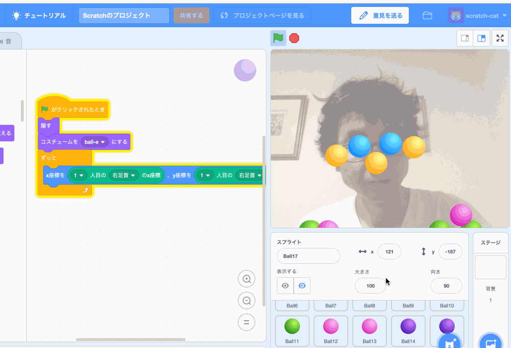

# PoseNet2Scratch

*Read this in other languages: [English](README.md), [日本語](README.ja.md)*

PoseNet2Scratchは人の姿勢を検出し、身体の各部分のxとyの位置を取得できるScratch拡張ブロックを追加することができます。

PoseNet2Scratchを拡張機能として追加できる[独自バージョンのScratch 3](https://champierre.github.io/scratch/)で体験できます。
